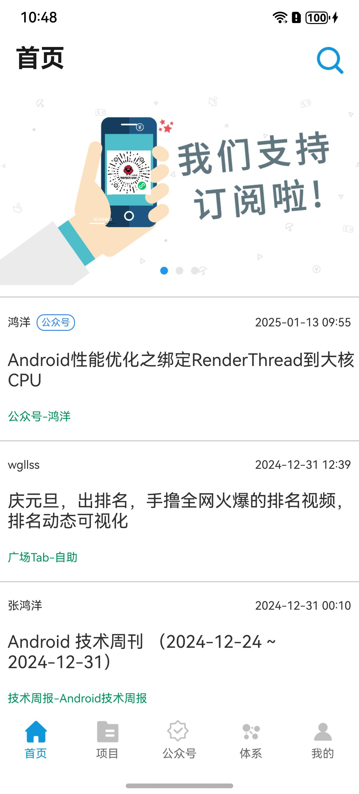
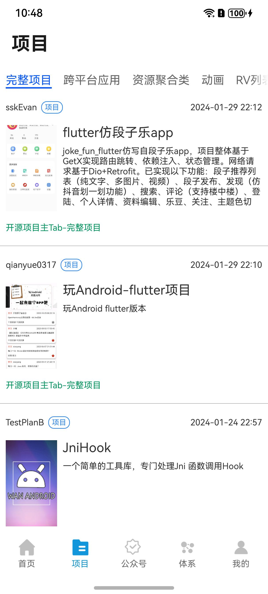
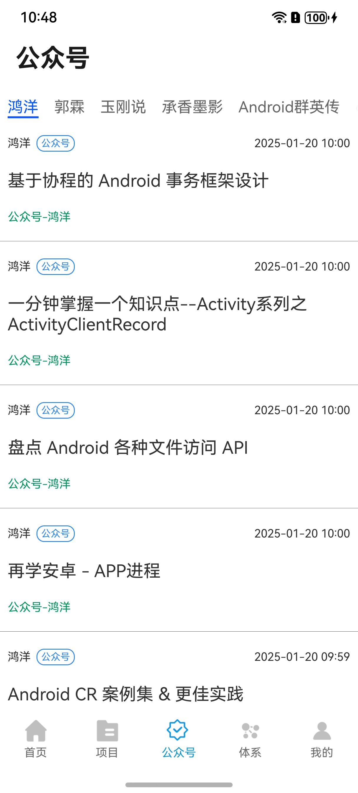
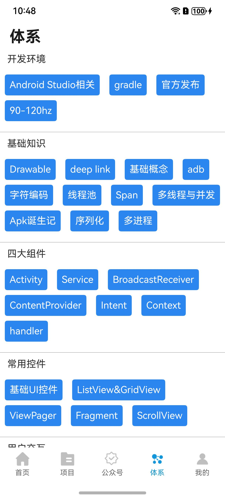
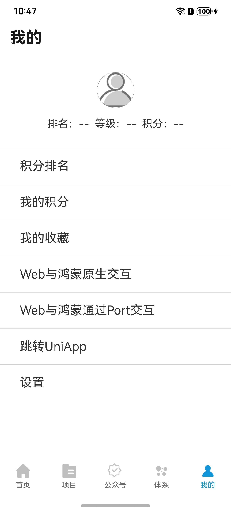

# HarmonyStudy
使用ArkTS与ArkUI编写HarmonyOS的wanandroid客户端。

## 前言

继Swift、Flutter、UniApp之后，尝试开发了HarmonyOS的wandroid版本，如果从设计角度看，这个项目的整体架构其实和RxStudy、GetXStudy都一脉相承，由于是响应式编程，所以我觉得更加靠近Flutter的版本。

另外，不要问我为啥不用SwiftUI写一套，不写就是因为学不动了o(╥﹏╥)o。

## 关于这个项目

这个项目我主要是通过HarmonyOS的原生框架进行搭建，通过[WanAndroid开放API](https://www.wanandroid.com/)制作。

这个项目的目的，是为了工作上的鸿蒙开发练手而用，实际上工作上的项目难度系数感觉就像地狱级的。

这个项目的UI和组件我基本上都是使用原生，从引入的第三方库就可以知道依赖项很少。

写Flutter之前我使用的是VSCode，这个鸿蒙项目我就只能使用DevEco Studio，用完之后，回头又用Android Studio写Flutter，瞬间就特别嫌弃Xcode，别人家创建module浑然天成，Xcode就算目前有SwiftPackage，但是总感觉不够方便。

#### 界面截图

|  |  |  |  |  |
| ---------------------- | ---------------------- | ---------------------- | ---------------------- | ---------------------- |

### 功能说明

* 首页、项目、公众号、体系、我的，五大模块
* 登录注册功能
* 搜索功能：热门搜索、输入搜索
* 文章列表
* Tab切换功能
* 自动轮播图
* 下拉刷新，上拉加载更多
* 引入的uni-app-runtime，可以执行uniApp小程序，另外由于HarmonyOS中运行wgt文件，必须使用vue3版本的uni模版，于是我的uni-app版wanandroid客户端无法打出正常的wgt文件，在这个项目中无法正常运行，在这方面感兴趣的，可以到RxStudy项目上的develop_uniapp分支上面查看。

### 引入的第三库

```ruby
"@ohos/axios": "2.2.4",
"@ohos/imageknife": "3.1.0",
"@ohos/pulltorefresh": "2.0.5",
"@pura/harmony-utils": "1.0.2",
"@dcloudio/uni-app-runtime": "^2.3.14"
```

## Swift版wanandroid客户端

[项目地址](https://github.com/seasonZhu/RxStudy)

## Flutter版wanandroid客户端

[项目地址](https://github.com/seasonZhu/GetXStudy)

## HarmonyOS版wanandroid客户端

[项目地址](https://github.com/seasonZhu/HarmonyStudy)

## uni-app版wanandroid客户端

[项目地址](https://github.com/seasonZhu/UniAppPlayAndroid)

## 我的掘金主页

[我的主页](https://juejin.cn/user/4353721778057997)

## 华为的一些最佳实践文档

[架构](https://developer.huawei.com/consumer/cn/doc/best-practices-V5/bpta-architecture-design-V5)

[状态管理最佳实践](https://developer.huawei.com/consumer/cn/doc/best-practices-V5/bpta-status-management-V5)

[长列表加载性能优化](https://developer.huawei.com/consumer/cn/doc/best-practices-V5/bpta-best-practices-long-list-V5#section11667144010222)

[应用隐私保护](https://developer.huawei.com/consumer/cn/doc/best-practices-V5/bpta-app-privacy-protection-V5)

[合理使用页面间转场](https://developer.huawei.com/consumer/cn/doc/best-practices-V5/bpta-page-transition-V5)

[合理使用动画](https://developer.huawei.com/consumer/cn/doc/best-practices-V5/bpta-fair-use-animation-V5)

[帧率和丢帧分析实践](https://developer.huawei.com/consumer/cn/doc/best-practices-V5/bpta-frame-practice-V5)